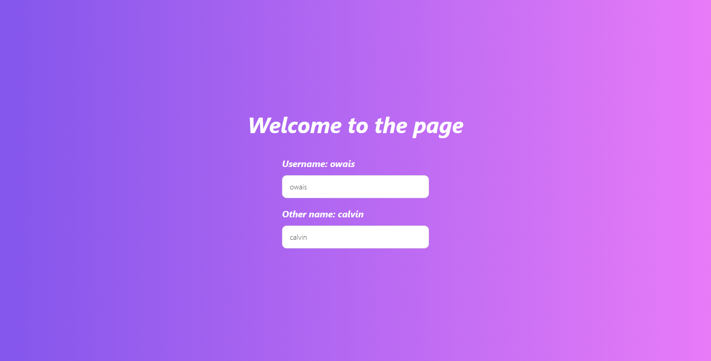

# Live Demo Link
## [Live Demo](https://simple-test-react.netlify.app/)
# project description
This is a project to test the use of global state in a react app, using the context api.
Using the context api, we can pass data from a parent component to a child component, without having to pass it through the props.
This is useful when we have a lot of components that need to access the same data.
Technically, we have 3 popular ways to manage global state in react:

1. Redux
2. Mobx
3. Context API

Global state is useful to avoid prop drilling, which is passing props through multiple components to reach a child component.

# Screenshot

